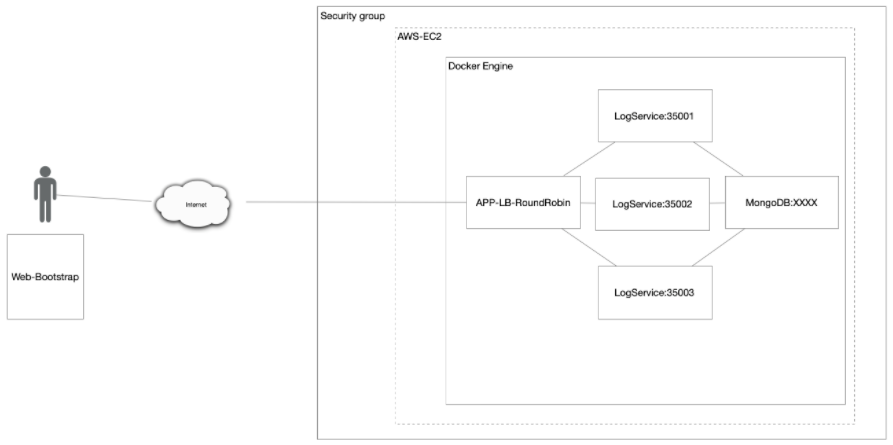

# Taller de Modularización

## Descripción
Para la tarea usted debe construir una aplicación con la arquitectura propuesta y desplegarla en AWS usando EC2 y Docker.

## Arquitectura propuesta


1. El servicio MongoDB es una instancia de MongoDB corriendo en un container de docker en una máquina virtual de EC2.
2. LogService es un servicio REST que recibe una cadena, la almacena en la base de datos y responde en un objeto JSON con las 10 ultimas cadenas almacenadas en la base de datos y la fecha en que fueron almacenadas.
3. La aplicación web APP-LB-RoundRobin está compuesta por un cliente web y al menos un servicio REST. El cliente web tiene un campo y un botón y cada vez que el usuario envía un mensaje, este se lo envía al servicio REST y actualiza la pantalla con la información que este le regresa en formato JSON. El servicio REST recibe la cadena e implementa un algoritmo de balanceo de cargas de Round Robin, delegando el procesamiento del mensaje y el retorno de la respuesta a cada una de las tres instancias del servicio LogService.

## Diseño de las clases

El proyecto se encuentra dividido en tres partes.

* La primera parte es el contenedor de MongoDB que corre en Docker, esta
  se puede encontrar en el siguiente link [imagen de MongoDB](https://hub.docker.com/_/mongo).

* La segunda parte es el logService, este se encuentra en la carpeta LogService, esta clase es
  la encargada de hacer la conexión con la base de datos de MongoDB, y adicionalmente, es la encargada de realizar las
  diferentes consultas sobre la base de datos.

* La tercera parte se encuentra en la carpeta roundRobin, en esta carpeta se encuentran el cliente web, en la clase SparkWebApp, y el RoundRobin, en la clase con el mismo nombre, esta clase se encarga de
  organizar la manera en la cual los LogService van a interactuar por turnos con la base de datos.

### Round-Robin

Es un método para seleccionar todos los abstractos en un grupo de manera equitativa y en un orden racional, normalmente comenzando por el primer elemento de la lista hasta llegar al último y empezando de nuevo desde el primer elemento.

En este caso para implementar el Round-Robin se uso una PriorityQueue.

Primero se crea una PriorityQueue, luego se adicionan los elementos, en este caso los diferentes hosts.

```
public RoundRobin() {
        queue =  new PriorityQueue<>();
        queue.add("http://localhost:35001");
        queue.add("http://localhost:35002");
        queue.add("http://localhost:35003");
}
```
Luego cada vez que se vaya a seleccionar un elemento, se extrae el primer elemento en la cola, este
será el host que se va a usar, luego se vuelve a añadir a la cola, de esta manera haciendo la rotación entre elementos.
```
private String selectHost() {
        String returnHost = queue.poll();
        queue.add(returnHost);
        return returnHost;
}
```